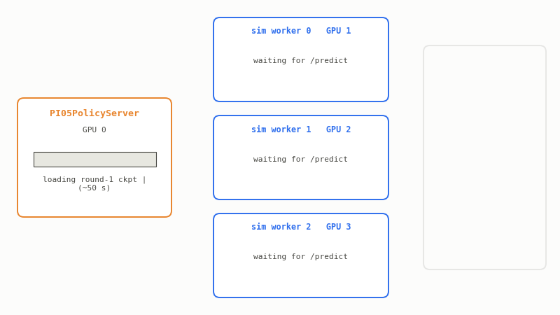
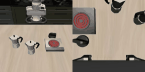
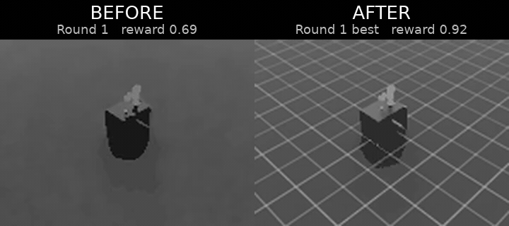

# Scaling Physical AI & Robotics Systems with Ray

An end-to-end physical-AI workflow on **Ray + Anyscale**, taught as a series of
self-contained, runnable notebooks. You stream robotics data, fine-tune a
Vision-Language-Action (VLA) policy, serve it and evaluate it in simulation,
close the loop by folding sim trajectories back into training, pre-train a
**world model** at scale, and finally **distill** a large model into a small
backbone you could deploy on a robot.

> **Scale up to learn; scale down to deploy.**

The point of the course is the **infrastructure**. The models (PI0.5, V-JEPA,
ResNet/MobileNet) are the workload; the lesson is how a handful of Ray
primitives (**Ray Data**, **Ray Train**, **Ray Serve**, and **Ray remote
tasks**) handle streaming data, distributed training, live serving, and
parallel simulation on one cluster. Swap in your own models and the
orchestration code barely changes.

<p align="center">
  
</p>
<p align="center">
  <sub>One cluster: a policy server on one GPU, Isaac Lab
  simulators fanned out on the rest, all of it handed back when the phase ends.</sub>
</p>

**Start here:** open [`00_overview.ipynb`](./00_overview.ipynb) and read forward.
There is nothing to install first. The course image carries every dependency, no
Hugging Face token is needed, and each notebook connects to the running cluster in
its own first cell. The agent setup further down applies only to the optional
SmolVLA track.

---

## The lifecycle

```
   ┌─────────┐   ┌──────────────┐   ┌────────────┐   ┌─────────────┐
   │  DATA   │──▶│  FINE-TUNE   │──▶│   SERVE    │──▶│   SIMULATE  │
   │ Ray Data│   │  a VLA       │   │ the policy │   │  & evaluate │
   │ stream  │   │  Ray Train   │   │ Ray Serve  │   │ Ray tasks   │
   └─────────┘   └──────────────┘   └────────────┘   └──────┬──────┘
        ▲                                                   │
        │                  CLOSE THE LOOP                   │
        └───────────  filter by reward, union  ◀────────────┘
                              │
            ┌─────────────────┴───────────────────┐
            ▼                                     ▼
   ┌──────────────────┐                  ┌────────────────────┐
   │  WORLD MODEL     │                  │   DISTILL FOR EDGE │
   │  pre-train at    │  ───────────▶    │  big teacher →     │
   │  scale (V-JEPA)  │   scale down     │  small student     │
   │  Ray Train       │                  │  Ray Train         │
   └──────────────────┘                  └────────────────────┘
```

---

## Course map

| # | Notebook | You learn | Ray primitive |
|---|----------|-----------|---------------|
| 00 | `00_overview.ipynb` | The lifecycle, the through-line, how to navigate | n/a |
| 01 | `01_robotics_data_pipelines.ipynb` | Stream LeRobot v3 video, partition, preprocess | **Ray Data** |
| 02 | `02_vla_finetuning.ipynb` | Distributed DDP fine-tune of PI0.5 (3.4B) | **Ray Train** |
| 03 | `03_serving_and_sim_eval.ipynb` | Serve the policy + fan out Isaac Lab rollouts + close the loop | **Ray Serve**, **Ray tasks** |
| 04 | `04_world_model_pretraining.ipynb` | Pre-train a V-JEPA world model + online adaptation | **Ray Data**, **Ray Train** |
| 05 | `05_distillation_for_edge.ipynb` | Distill a large teacher into a deployable student | **Ray Data**, **Ray Train** |

**Outline coverage:** robotics data prep (01) · VLA pre-training & fine-tuning
(02 fine-tune, 04 pre-train) · distributed simulation & evaluation (03) ·
scalable inference (03 serving, 05 edge) · world-foundation model pre-training
at scale (04).

### What goes in

The training data is **LIBERO**, streamed straight from the public S3 mirror by
`tools/lerobot_datasource.py`: no download step, no local copy. Each episode is a
language instruction plus two synchronized camera streams, and both views are what
PI0.5 actually consumes:

<table>
<tr>
<td align="center" width="50%">
  <br>
  <sub><b>"put both moka pots on the stove"</b></sub>
</td>
<td align="center" width="50%">
  <br>
  <sub><b>"put the white mug on the left plate and put the yellow<br>and white mug on the right plate"</b></sub>
</td>
</tr>
</table>

<p align="center">
  <sub>Left half of each clip: <code>observation.images.image</code> (scene). Right half:
  <code>observation.images.image2</code> (wrist). 273,465 frames across 37 file groups,
  decoded on the fly.</sub>
</p>

### What comes out of the loop

Every sim worker saves the episode it rolled out, so each round of notebook 03
hands you the Franka arm actually being driven by the policy you just trained:

<table>
<tr>
<td align="center" width="50%">
  <br>
  <sub><b>Round 1.</b> Policy fine-tuned on LIBERO only.</sub>
</td>
<td align="center" width="50%">
  <br>
  <sub><b>Round 2.</b> After rewarded sim episodes were folded back into training.</sub>
</td>
</tr>
</table>

These are smoke-scale runs (50 training steps in notebook 02, 100 in notebook 03's
round-2 retrain), so expect exploratory motion rather than a clean pick. What is being demonstrated is the loop: serve, roll out, filter by
reward, `union()` into the training stream, retrain, and compare under identical
seeds. See [A note on scope](#a-note-on-scope) for why the motion looks this way.

#### More training buys tighter motion

Below is the same pipeline at real scale instead of smoke scale: one full epoch
of LIBERO (34,000 steps) fine-tuned with DDP across 8 A10G GPUs, served behind
Ray Serve, then queried over HTTP by parallel Isaac Lab simulators dropped in
front of the cube. This was run as a standalone job, not by stepping through the
notebooks; see
[Instance types](#instance-types) for what the notebooks themselves require.
Both panels are rollouts from **that same round**, a weaker attempt beside the
round's best:

<p align="center">
  
</p>
<p align="center">
  <sub>Episode-total shaped reward on Isaac Lab's lift task: <b>0.69</b> left,
  <b>0.92</b> right.</sub>
</p>

That spread is exactly what makes the flywheel turn. A single epoch already
produces episodes worth learning from, and reward is what separates them:
episodes clearing the reward threshold are folded back into training, the rest
are dropped. The policy's own best behavior becomes its next training signal. Successive
rounds are how the right-hand panel becomes the average case rather than the
lucky one.

The notebooks are designed to be read in order, and they cross-reference each other.

> **A note on the figures and captured output.** The diagrams, logs, and cell outputs
> in this course were captured on the **reference configuration**: four T4s on a single
> `g4dn.12xlarge` with 192 GB of host RAM. That is not a ceiling. The same code paths
> scale to larger clusters with no edits, adding Ray Train workers as you add GPUs and
> parallel simulators as you add GPU nodes, so expect your own worker counts, throughput,
> and timings to differ from the printed ones. See [Cluster](#cluster) for exactly what
> changes with GPU count.

---

## Agent-led track: SmolVLA fine-tuning

Running alongside the notebooks is an **agent-led** exercise. Instead of stepping
through cells yourself, you point a coding agent at Anyscale and have it fine-tune
**SmolVLA**, a compact VLA policy, on the same LeRobot data this course streams.

The agent does the work you would otherwise do by hand: pick the compute, write
the job config, launch it, watch the logs, and report back what it got. That is
what `anyscale skills install` in the box below is for. It gives whichever
agent you installed the Anyscale platform skills, so it knows how to build a
Ray Train workload, submit it, and read the result.

Same lesson as the rest of the course, arrived at from the other direction: the
orchestration is config, not code, which is exactly why an agent can drive it.

**The brief lives in [`prompts/smolvla_agent.txt`](./prompts/smolvla_agent.txt).**
Hand it to your agent as-is once the setup below is done. It states the smoke-test
goal, pins the run to the GPUs already in this workspace, and tells the agent not
to hand back until loss is printing and a checkpoint is written.

**Ground rules come first.** An agent handed cluster access and no constraints will
provision its own nodes, rebuild an environment that already works, or hardcode a GPU
count that holds only on the shape it happened to see. Stating the boundaries before the
first command is what makes an agent run reproducible, and it is good practice on any
agent-driven workload rather than a quirk of this course.
[`tools/AGENT_RULES.md`](./tools/AGENT_RULES.md) is that file here. It pins the work to
the GPUs already attached, requires hardware to be detected rather than assumed (bf16 on
Ampere and newer, fp16 with a `GradScaler` on T4), sends the agent to the S3 weight mirror
before Hugging Face, sets run-naming and cleanup discipline, and defines what counts as
done. The brief opens with `Read AGENT_RULES.md and follow it throughout`, so the agent
loads the rules before it touches the cluster.

> ### Setup: install your agent
>
> Install one agent CLI, then the Anyscale skills. Copy and paste as is.
>
> **Install an agent CLI.** Pick one. Claude Code and Cursor are standalone and
> need no Node:
>
> ```bash
> # Claude Code, standalone, no Node needed
> curl -fsSL https://claude.ai/install.sh | bash
>
> # Cursor CLI (cursor-agent), standalone, no Node needed
> curl https://cursor.com/install -fsS | bash
>
> # Codex CLI, npm package, needs Node
> npm install -g @openai/codex
>
> # Copilot CLI, npm package, needs Node
> npm install -g @github/copilot
> ```
>
> **Then install the skills.** Same three commands whichever CLI you picked:
>
> ```bash
> pip install -U anyscale
> anyscale login
> anyscale skills install -p claude-code -p cursor -p codex --accept-terms
> ```
>
> `anyscale skills install` is what teaches your agent this platform, so don't
> skip it.

---

## Repo layout

```
.
├── 00_overview.ipynb … 05_distillation_for_edge.ipynb   the course, read in order
├── prerequisite_00_ray_data.ipynb                       optional Ray warm-ups
├── prerequisite_01_ray_train.ipynb
├── tools/          shared Python imported by the notebooks
│   └── AGENT_RULES.md   ground rules the agent-led track loads first
├── prompts/        the agent-led track's brief
├── assets/         GIFs and diagrams the notebooks display
├── Dockerfile      the cluster image (single source of truth)
├── SETUP.txt       the agent-install steps as plain text, for sharing
└── README.md
```

Everything under `tools/` is imported as a package, so one style works on the
driver and on every Ray worker alike, because Ray puts the `runtime_env` working
directory (this repo root) on `sys.path`:

```python
from tools import cluster, util
from tools.lerobot_datasource import LeRobotDatasource
from tools.policy_server import PI05PolicyServer
```

`tools/sim_worker.py` is the one exception: it runs as a standalone subprocess
(`python -u tools/sim_worker.py`), so it imports its sibling `franka_env`
directly rather than through the package.

### Shared modules

| File | Used by | Role |
|------|---------|------|
| `tools/lerobot_datasource.py` | 01/02/03/04 | Ray Data `Datasource` for LeRobot v3 (streaming parquet + mp4) |
| `tools/cluster.py` | 00–05 | Reads the live cluster shape; derives every train/sim worker count |
| `tools/util.py` | 02/03 | Model load/freeze, checkpoint I/O, LR schedule, node staging |
| `tools/viz.py` | 01–05 | Renders the inline GIFs from `assets/` |
| `tools/policy_server.py` | 03 | `@serve.deployment` PI0.5 HTTP policy server |
| `tools/franka_env.py` | 03 | Isaac Lab `Isaac-Lift-Cube-Franka-v0` wrapper |
| `tools/sim_worker.py` | 03 | Standalone subprocess: boots Isaac Lab, queries Serve, saves GIF + trajectory |

---

## Prerequisites

### Cluster

An Anyscale cluster running the image defined in [`Dockerfile`](./Dockerfile). The head
node is CPU-only; the GPU workers are accessed via Ray.

| Requirement | Minimum | Set by |
|---|---|---|
| GPUs | 2 or 4 | one Ray Train worker per GPU; notebook 03 reserves one for the policy server |
| VRAM | 16 GB per GPU | PI0.5 (3.4B) fine-tunes in bf16; the reference run is on T4s |
| **Host RAM** | **48 GB per GPU** | loading PI0.5 spikes ~16 GB of *host* RAM per worker, in 02 and 03 |

> **Pick the instance on host RAM, not on VRAM.** Every GPU below has VRAM to spare. Host
> RAM is what decides whether a shape finishes the course, and it is where the currently
> common 32 GB single-GPU shapes fall short.

#### Instance types

| Instance | GPUs per node | GPU (VRAM) | Host RAM | Per GPU | Runs the full course? |
|---|---|---|---|---|---|
| `g4dn.12xlarge` | 4 | T4 (16 GB) | 192 GB | 48 GB | **Yes**. Reference config; every committed output came from this shape |
| `g6.12xlarge` | 4 | L4 (24 GB) | 192 GB | 48 GB | **Yes**. Same host shape as the reference |
| `g7e.4xlarge` | 1 | RTX PRO 6000 (96 GB) | 128 GB | 128 GB | **Yes**. Use 2 or 4 of them |
| `g5.4xlarge`, `g6.4xlarge` | 1 | A10G / L4 (24 GB) | 64 GB | 64 GB | Clears the budget on paper, **not validated here** |
| `g4dn.2xlarge`, `g5.2xlarge`, `g7.2xlarge` | 1 | T4 (16 GB) / A10G (24 GB) / RTX PRO 4500 (32 GB) | 32 GB | 32 GB | **No**. 00 to 02 run on a fresh cluster, then 03 is OOM-killed |
| `g4dn.xlarge` | 1 | T4 (16 GB) | 16 GB | 16 GB | **No**. Under one PI0.5 load; fails in 02 |

**So: one 4-GPU node, or two-to-four `g7e.4xlarge`.** Earlier versions of this README
listed the 32 GB single-GPU shapes as running the full course. They do not, and the
failure is host RAM, not GPU.

#### Why 48 GB of host RAM per GPU

* PI0.5's weights are materialized **on the host** before they move to the GPU: a
  **~16 GB transient spike per worker**, even though the loaded policy then sits at only
  ~3.3 GB resident.
* Ray's raylet holds back ~30% of the node for its object store, and a node that has just
  finished a training round is still holding plasma blocks and idle spill workers.
* Notebook 03 loads PI0.5 **three times** (round-1 policy server, retrain workers,
  round-2 policy server), each time on a node that just finished training.
* On a 32 GB node that leaves **~14–18 GB free against a 17 GB requirement**, and it does
  not fail cleanly: the host OOM killer SIGKILLs the raylet, the node is marked dead, and
  the run reports `SYSTEM_ERROR ... connection error code 2`.

`wait_for_host_headroom()` in [`tools/util.py`](./tools/util.py) gates every phase
transition on 17 GB per GPU worker and logs what it is waiting on, so a squeezed node is
visible before it is killed.

**Checking a node you already have.** Every notebook's `cluster.describe()` prints
`N GiB Ray memory` per node, which is roughly 60% of physical RAM. The reference node prints
`4 x T4, 48 CPU, 115 GiB Ray memory`: a 192 GB host, ~29 GiB of Ray memory per GPU. Under
~25 GiB per GPU, notebook 03 will not finish.

#### What each notebook needs

Resource use is phased, so the cluster is never over-subscribed whatever its size. Ray
releases every GPU between phases, and no notebook needs a GPU another is still holding.

| Notebook | What holds a GPU | On 2 GPUs | On 4 GPUs | Host-RAM spike |
|---|---|---|---|---|
| 00 overview | nothing (prose and diagrams) | 0 | 0 | none |
| 01 data pipelines | nothing (Ray Data decodes video on CPU) | 0 | 0 | none (object store capped at 4 GiB) |
| 02 VLA fine-tune | one Ray Train worker per GPU | 2 | 4 | **17 GB × workers on the node** |
| 03 sim-eval phase | 1 Serve policy replica + one Isaac Lab rollout per *remaining GPU node* | 1 replica + 1 sim | 1 replica + 1 sim on one 4-GPU node; 1 replica + 3 sims across four 1-GPU nodes | **17 GB on the replica's node** |
| 03 retrain phase | one Ray Train worker per GPU | 2 | 4 | **17 GB × workers on the node** |
| 04 world model | one Ray Train worker per GPU | 2 | 4 | none (6-layer ViT-Small V-JEPA) |
| 05 distillation | one Ray Train worker per GPU | 2 | 4 | none (ResNet-50 teacher, MobileNetV3 student) |

Notebook 03 is the tightest point in the course on both axes. It is also the only one
whose worker count depends on cluster *shape* rather than GPU count: the policy replica
reserves one GPU for the whole sim phase, and Isaac Sim boots one Kit runtime per process
sharing a per-node extension cache, so the fan-out is `min(GPUs − 1, GPU nodes)`. Four
GPUs on four nodes gives 3 parallel rollouts; the same four GPUs on one node gives 1.

#### How the worker counts are derived

**Nothing in this course is pinned to a GPU count, a GPU model, or an instance type.**
Every worker count is read from the live cluster at runtime by
[`tools/cluster.py`](./tools/cluster.py):

| Setting | Derived as | 2 GPUs | 4 GPUs |
|---|---|---|---|
| Ray Train workers (02, 04, 05) | one per GPU | 2 | 4 |
| Sim workers (03) | one per GPU node, at most GPUs − 1 | 1 | 1 on one node, 3 across four |
| Effective batch (02) | `batch_size(1) × grad_accum(16) × workers` | 32 | 64 |

Every notebook opens with `cluster.describe()`, which prints the GPU count, GPU model, and
per-node layout it found, along with the worker counts derived from them. Set `NUM_WORKERS`
or `SIM_WORKERS` in the environment to pin a run smaller than the cluster.

**No credentials of any kind.** Datasets, the PI0.5 weights, and the PaliGemma tokenizer all
come from a public S3 mirror (`s3://anyscale-public-materials-use2/ray_summit_robotics_2026/`)
read unsigned, and the notebooks run with `HF_HUB_OFFLINE=1`, so no Hugging Face token is
needed at run time or build time. (`google/paligemma-3b-pt-224` is redistributed under the
Gemma Terms of Use; see `GEMMA_NOTICE.txt` at that prefix.)

### Tested configuration

| Component | Version |
|-----------|---------|
| Ray | 2.53.0 and 2.55.0 |
| Python | 3.11 |
| PyTorch | 2.7.0 + CUDA 12.8 |
| Isaac Sim | 5.1.0 |
| Isaac Lab | 0.54.4 (`main@b0542fe`, pinned commit, built from source) |
| lerobot | 0.4.3 (`--no-deps`) |
| transformers | `huggingface/transformers@dcddb97` (patched fork, pinned commit) |

**Why the patched transformers fork?** PI0.5's checkpoint stores Gemma
layernorm parameters under a different key layout than mainline `transformers
>= 4.57`, and `PI05Pytorch.__init__` aborts unless `transformers.models.siglip.check`
exists, a symbol only in the fork.

**Why `lerobot --no-deps`?** lerobot's `rerun-sdk` dependency requires
`numpy >= 2`, which breaks Isaac Sim's compiled ABI. Install `--no-deps` and
pin `numpy>=1.26,<2`.

**Why `TORCHDYNAMO_DISABLE=1`?** PI0.5 calls `torch.compile` internally; the
worker nodes have no C compiler, so dynamo falls back to eager cleanly.

### Cluster image (Dockerfile)

The image is defined by [`Dockerfile`](./Dockerfile) in this directory, which is the single
source of truth; build that file as-is.

Two things worth knowing before you build:

- **The NVIDIA graphics-userspace block is required.** The container runtime injects only
  *compute* driver libs, so the Dockerfile bakes the graphics libs Isaac Sim's Vulkan/RTX
  renderer needs from the version-matched driver `.run`. `NV_DRIVER_VERSION` tracks the host
  driver reported by `nvidia-smi --query-gpu=driver_version --format=csv,noheader`.
- **Isaac Lab and the transformers fork are both pinned to a commit** (`ISAACLAB_COMMIT`
  and the `transformers` git URL), so independent builds resolve to the same code instead
  of tracking a moving branch.

(No Weights & Biases in the tutorial; metrics are reported through Ray Train. `wandb` is
installed only because lerobot expects it to be importable.)

---

## A note on scope

Both the LIBERO training data and Isaac Lab's `Isaac-Lift-Cube-Franka-v0` use a
**Franka Panda**, so the action and state dimensions line up cleanly. What PI0.5
has *not* seen is this exact setup: Isaac Lab's action/control convention, scene
and coordinate frame, and camera views (we feed one render into both of PI0.5's
camera inputs). So in 02/03 expect **exploratory motion, not task success**: we're
validating the **orchestration loop**, not manipulation skill. Every run *in the
notebooks* is at smoke scale (small step counts); the full-epoch clip above is a
separate run on a larger cluster, shown to make the point that the ceiling is
training budget rather than the code. The lesson is that the *same code* scales to
production by changing config, not logic.
